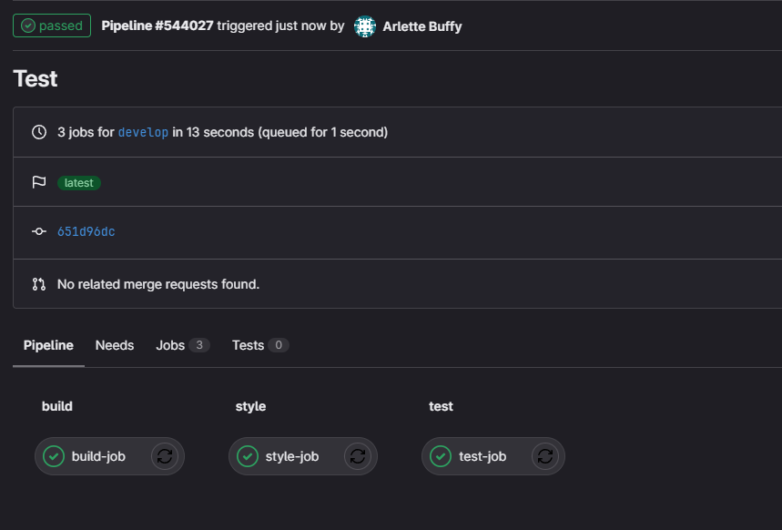
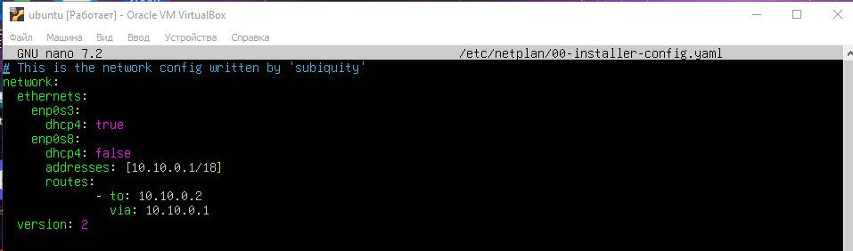
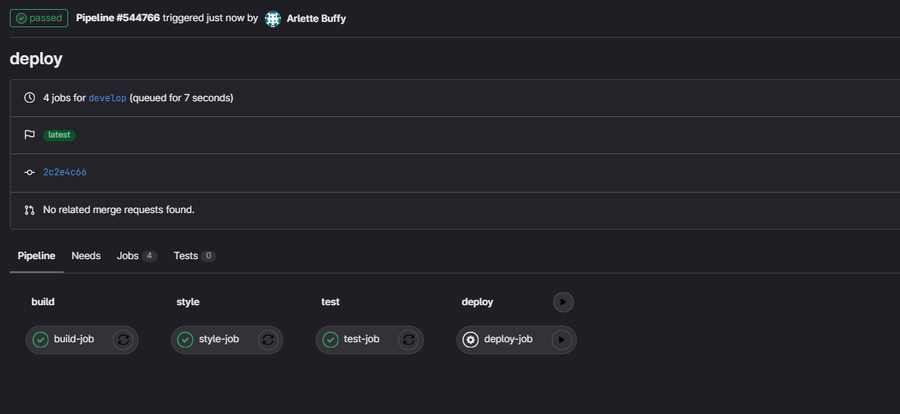
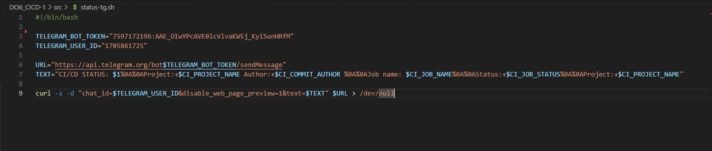

# Basic CI/CD

Разработка простого **CI/CD** для проекта _SimpleBashUtils_. Сборка, тестирование, развертывание.

## Contents

### Part 1. Настройка **gitlab-runner**

**== Задание ==**

##### 1.1 создание виртуальной машины _Ubuntu Server 22.04 LTS_.
\


### 1.2. Создание общей папки по [инструкции](https://meandubuntu.ru/2017/03/%D0%BE%D0%B1%D1%89%D0%B8%D0%B5-%D0%BF%D0%B0%D0%BF%D0%BA%D0%B8-shared-folders-virtualbox-%D0%B8-ubuntu-server-16-04/)

```
  sudo apt-get update && sudo apt-get install build-essential
  cd && mount /dev/cdrom shared/
  sudo sh shared/VBoxLinuxAdditions.run && shutdown -h now
```

Настройка общей папки в VirtualBox (settings -> shared folders) \


```
  cd && mkdir mount/
  chown andrey:andrey mount/
  sudo mount -t vboxsf Programming mount/
```

### 2. Установка gitlab-runner.

- Установка и старт gitlab-runner ([Using binary file](https://docs.gitlab.com/runner/install/linux-manually.html))

```
sudo curl -L --output /usr/local/bin/gitlab-runner "https://s3.dualstack.us-east-1.amazonaws.com/gitlab-runner-downloads/latest/binaries/gitlab-runner-linux-amd64"
sudo chmod +x /usr/local/bin/gitlab-runner
sudo useradd --comment 'GitLab Runner' --create-home gitlab-runner --shell /bin/bash
sudo gitlab-runner install --user=gitlab-runner --working-directory=/home/gitlab-runner
sudo gitlab-runner start
```


- Проверка статуса сервиса gitlab-runner

```
systemctl status gitlab-runner.service
```


##### 3. Запусти **gitlab-runner** и зарегистрируй его для использования в текущем проекте (_DO6_CICD_).

- [Зарегистрировать gitlab-runner](https://docs.gitlab.com/runner/register/)

Регистрация раннера в gitlab-runner
```
sudo gitlab-runner register
```

- Для регистрации понадобятся:

  - Cвой URL-адрес GitLab
  - Cвой регистрационный токен
  - Название раннера
  - Теги для заданий, разделенные запятыми
  - Тип исполнителя

- URL и токен получить на страничке задания на платформе.


### Part 2. Сборка
2.1 Создание и конфигуация .gitlab-ci.yml в корне репозитория

```yml
build-job:
  stage: build
  tags:
    - build
  script:
    - cd ./src/cat 
    - make s21_cat 
    - cd ../grep 
    - make s21_grep
  artifacts:
    paths:
      - src/cat/s21_cat
      - src/grep/s21_grep
    expire_in: 30 days
  only:
    - develop
```

- Запушим .gitlab-ci.yml

Раннер успешно выполнил pipeline по сборке проекта:


### Part 3. Тест кодстайла
3.1 Добавляем stage для кодстайла в gitlab-ci.tml и пушим в репозиторий 

```yml
style-job:
  stage: style
  tags:
    - style
  script:
    - cd src/cat && clang-format -style=Google -Werror -n *.c *.h
    - cd ../grep && clang-format -style=Google -Werror -n *.с
  only:
    - develop
```

Пушим намеренно код с ошибкой, как видим pipeline был зафейлен из-за того, что код не прошел проверку кодстайла\
\


Исправляем кодстайл, запускаем проверку вновь. Кодстайл прошёл успешно вместе с pipeline\


### Part 4. Интеграционные тесты

Добавляем test в .gitlab-ci.yml: 

```yml
test-job:
  stage: test
  tags:
    - test
  script:
    - cd src/cat
    - make test
    - cd ../grep
    - make test
  when: on_succes
```
- Пушим проект с ошибкой в тестах, видим, что pipeline успеешно находит ошибку и фейлится\
\
.png)

- Исправляем ошибку и пушим изменения\
\
\


### Part 5. Этап деплоя

Изменяем файл /etc/netplan/00-installer-config.yaml на обеих машинах:\
\


Проверяем, что машины видят друг друга \


##### Запусти этот этап вручную при условии, что все предыдущие этапы прошли успешно.

##### Напиши bash-скрипт, который при помощи **ssh** и **scp** копирует файлы, полученные после сборки (артефакты), в директорию _/usr/local/bin_ второй виртуальной машины.

##### В файле _gitlab-ci.yml_ добавь этап запуска написанного скрипта. В случае ошибки «зафейли» пайплайн.

Пишем copy.sh:\


Затем добавляем deploy в наш .gitlab-ci.yml
```yml
deploy-job:
  stage: deploy
  tags:
    - deploy
  when: manual
  script:
    - chmod +x copy.sh 
    - sh copy.sh
  only:
    - develop
```

Затем выдаем права на второй машине для папки /usr/local/bin \
sudo chnmod -R 777 /usr/local/bin \


- Генерируем SSH-ключи


- Копируем наш открытый SSH-ключ на машину **production**. Это автоматизируем процесс, позволяя нам подключаться по SSH без ввода пароля.


- Добавить SSH-ключей в known_hosts


- Копируем исполняемые файлы в машину **production**. В результате получем готовые к работе приложения из проекта _C2_SimpleBashUtils_ (s21_cat и s21_grep) на второй виртуальной машине

  

- Пушим изменения не забываем запустить последний пайплайн. \
\
\


### Part 6. Дополнительно. Уведомления
Пишем status-tg.sh\
\
Добавляем данную строку к каждому stage:
```
after_script:
  - sh src/status-tg.sh
```
Напишем @botfather, чтобы создать бота и получить его токен \
\
Проверяем, что при каждом пуше у нас теперь приходят уведомления:\

