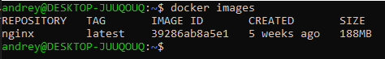
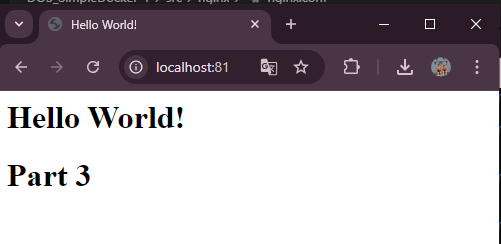

## Part 1. Готовый докер

Скачивание официального докер-образа с nginx при помощи docher pull. \


Проверка наличия докер-образа через docker images. \


Запуск докер-образа через docker run -d [image_id][repository]. \


Проверка, что образ запустился через docker ps: \


Информация о контейнере через docker inspect  [container_id|container_name] и запуск команды для отчета размер контейнера, список запампленных портов и id контейнера. \
 \
Size and ip: \
 \
Ports: \
 

Остановка и проверка докер образа через docker stop [container_id|container_name] и docker ps. \
 

Запусти докер с портами 80 и 443 в контейнере, замапленными на такие же порты на локальной машине, через команду run. \


Проверка, что в браузере по адресу localhost:80 доступна стартовая страница nginx \


Перезапуск докер контейнера через docker restart [container_id|container_name] и проверка любым способом, что контейнер запустился.


## Part 2. Операции с контейнером
Чтение конфигурационного файла nginx.conf внутри докер контейнера через команду exec. \


- Создаем на локальной машине файл nginx.conf.
- Настройка в нем по пути /status отдачу страницы статуса сервера nginx.\


- Копирования созданного файла nginx.conf внутрь докер-образа через команду docker cp. \


- Перезапуск nginx внутри докер-образа через команду exec. \


- Проверка, что по адресу localhost:80/status отдается страничка со статусом сервера nginx.\
 \


Экспорт контейнера в файл container.tar через команду export и остановка контейнера \
 

Удаление образа через docker rmi [image_id|repository], не удаляя перед этим контейнеры. \
 


Удаление остановленного контейнера.\
 

Импортирование контейнера обратно через команду import. \


Запуск импортированного контейнер. \
 \
 

Проверка, что по адресу localhost:80/status отдается страничка со статусом сервера nginx. \
 \
 


## Part 3. Мини веб-сервер
- Создание мини-сервера на C и FastCgi, который будет возвращать простейшую страничку с надписью Hello World!. \
 \
- Запуск написанного мини-сервера через spawn-fcgi на порту 8080 \
 

- Пишем nginx.conf, который будет проксировать все запросы с 81 порта на 127.0.0.1:8080. src/mini_server/nginx.conf \
 

- Помещаем файл nginx.conf в папку ./nginx/: cp nginx.conf ./nginx/nginx.conf 
- Помещаем docker cp ./nginx.conf temp:/etc/nginx/
- sudo docker exec temp apt-get update
- sudo docker exec temp apt-get install -y gcc spawn-fcgi libfcgi-dev
- sudo docker exec temp gcc /etc/nginx/mini_server.c -o /etc/nginx/webserver -l fcgi
- sudo docker exec temp spawn-fcgi -p 8080 /etc/nginx/webserver
- sudo docker exec temp nginx -s reload
- curl http://localhost:81/


- Открываем браузер и переходим по адресу: http://localhost:81 \
 \


## Part 4. Свой докер 
Написание своего докер-образа, который:
1) собирает исходники мини сервера на FastCgi из Части 3;
2) запускает его на 8080 порту;
3) копирует внутрь образа написанный ./nginx/nginx.conf;
4) запускает nginx. 

Сборка написанного докер-образа через docker build при этом указав имя и тег.\
 \

Проверка через docker images, что все собралось корректно. \
 

Запуск собранного докер-образа с маппингом 81 порта на 80 на локальной машине и маппингом папки ./nginx внутрь контейнера по адресу, где лежат конфигурационные файлы nginx'а (см. Часть 2).
 

Проверка, что по localhost:80 доступна страничка написанного мини сервера.\
 


Допиши в ./nginx/nginx.conf проксирование странички /status, по которой надо отдавать статус сервера nginx. \
 

Перезапуск докер-образа. Если всё сделано верно, то, после сохранения файла и перезапуска контейнера, конфигурационный файл внутри докер-образа должен обновиться самостоятельно без лишних действий\
 

Проверка, что теперь по localhost:80/status отдается страничка со статусом nginx\
 


## Part 5. Dockle

- Просканируй образ из предыдущего задания через dockle [image_id|repository]. \
 

- Исправвление образа так, чтобы при проверке через dockle не было ошибок и предупреждений.
> FATAL	- CIS-DI-0010 \
> Нужна проверка образа с флагами: \
> -ak NGINX_GPGKEYS \
> -ak NGINX_GPGKEY_PATH \

> FATAL	- DKL-DI-0005 \
> Добавить в Dockerfile строку для очистки кэша пакетов apt-get после установки необходимых пакетов: 
rm -rf /var/lib/apt/lists 

 

## Part 6. Базовый Docker Compose

1) Подними докер-контейнер из Части 5 (он должен работать в локальной сети, т.е. не нужно использовать инструкцию EXPOSE и мапить порты на локальную машину).
```
server {
        listen       81;
        server_name  localhost;

        location / {
            fastcgi_pass 127.0.0.1:8080;
        }

        location = /status {
            stub_status;
        }
}
```
2) Подними докер-контейнер с nginx, который будет проксировать все запросы с 8080 порта на 81 порт первого контейнера.
```
server {
        listen 8080;
	    location = / {
              proxy_pass http://temp:81;
			}
        location /status {
		           stub_status on;
	    }

    }
```

- Остановка всех запущенных контейнеров. \
 

- Сборка и запуск проекта с помощью команд docker-compose build и docker-compose up. \
 \
 

Проверка, что в браузере по localhost:80 отдается написанная тобой страничка, как и ранее.\

 