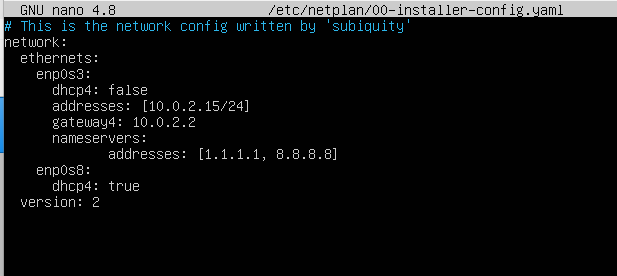
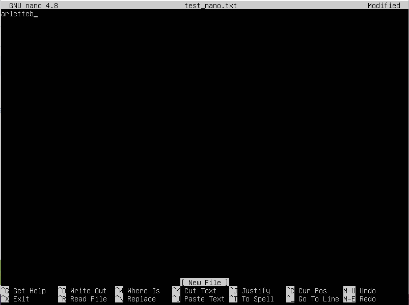
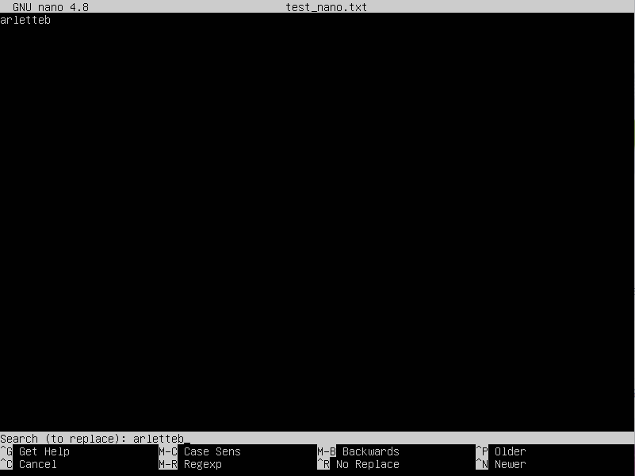
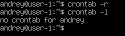

# Операционные системы UNIX/Linux (Базовый).

## Part 1. Установка ОС

**== Задание ==**

##### Установи **Ubuntu 20.04 Server LTS** без графического интерфейса. (Используем программу для виртуализации - VirtualBox)

- Графический интерфейс должен отсутствовать.

- Узнай версию Ubuntu, выполнив команду \
`cat /etc/issue.`
- Вставь скриншот с выводом команды.

Скриншот с выводом команды на версию Ubuntu\

## Part 2. Создание пользователя

**== Задание ==**

##### Создай пользователя, отличного от созданного при установке. Пользователь должен быть добавлен в группу `adm`.

- Вставь скриншот вызова команды для создания пользователя.
- Новый пользователь должен быть в выводе команды \
`cat /etc/passwd`
- Вставь скриншот с выводом команды.

Скриншот с командой создания пользователя\

Скриншот, что пользователнь добавлен в группу adm\
`-a`: --append(добавить) - добавляем пользователя\
`-g`: --groups(name) - к группе (название)\

Скриншот с выводом команды cat /etc/passwd\

## Part 3. Настройка сети ОС

**== Задание ==**

##### Задай название машины вида user-1.
##### Установи временную зону, соответствующую твоему текущему местоположению.  
##### Выведи названия сетевых интерфейсов с помощью консольной команды.
- В отчёте дай объяснение наличию интерфейса lo.  
##### Используя консольную команду, получи ip адрес устройства, на котором ты работаешь, от DHCP сервера. 
- В отчёте дай расшифровку DHCP.  
##### Определи и выведи на экран внешний ip-адрес шлюза (ip) и внутренний IP-адрес шлюза, он же ip-адрес по умолчанию (gw). 
##### Задай статичные (заданные вручную, а не полученные от DHCP сервера) настройки ip, gw, dns (используй публичный DNS серверы, например 1.1.1.1 или 8.8.8.8).  
##### Перезагрузи виртуальную машину. Убедись, что статичные сетевые настройки (ip, gw, dns) соответствуют заданным в предыдущем пункте.  

В отчёте опиши, что сделал для выполнения всех семи пунктов (можно как текстом, так и скриншотами).
Успешно пропингуй удаленные хосты 1.1.1.1 и ya.ru и вставь в отчёт скрин с выводом команды. В выводе команды должна быть фраза «0% packet loss».

1) Открываю через nano /etc/hostname и меняю на user-1\
\
Открываю через nano /etc/hosts и также меняю на user-1\
\
Также прописываем команду sudo hostnamectl set-hostname user-1 и перезагружаем, делаем проверку и выводим результат:\

2) Устанавливаю временную зону, соответствующую моему текущему местоположению\

3) Вывод названий сетевых интерфейсов 3 разными способами\
\
lo - (loopback device) - виртуальный интерфейс, присутствующий по умолчанию в любом Linux. Компьютер может использовать этот интерфейс для связи сам с собой, и это очень полезно при устранении неполадок и диагностике. К тому же он нужен, чтобы общаться с серверным приложением находящимся на том же компьютере. С этим интерфейсом всегда связан адрес 127.0.0.1. У него есть dns-имя – localhost.
4) При помощи консольной команды получаю ip адрес устройства, на котором работаю, от DHCP сервера.\
Как правило, в большинстве домашних сетей Интернет-WI-FI или маршрутизатор уже выступает в качестве DHCP-сервера. Следовательно, можно ввести следующую команду для получения ip по умолчанию в Linux\
\
DHCP (Dynamic Host Configuration Protocol) – это сетевой протокол, используемый в IP-сетях, в которых DHCP-сервер динамически назначает IP-адрес и другие параметры конфигурации сети каждому устройству в сети, чтобы они могли взаимодействовать с другими IP-сетями.

5) IP-адрес устройства, полученный от DHCP-сервера - 10.0.2.15, адрес шлюза 10.0.2.2, адрес сети 10.0.2.0/24.

6) Задаю статические данные\
Исходник:\

7) Исправленный:\
\
Проверяю, применяю изменения и пингую\

## Part 4. Обновление ОС
**== Задание ==**

##### Обнови системные пакеты до последней на момент выполнения задания версии.  

- После обновления системных пакетов, если ввести команду обновления повторно, должно появиться сообщение, что обновления отсутствуют;
- Вставь скриншот с этим сообщением в отчёт.

Скриншот с проверкой на наличие обновлений:\

## Part 5. Использование команды **sudo**

**== Задание ==**

##### Разреши пользователю, созданному в [Part 2](#part-2-создание-пользователя),выполнять команду sudo.

- В отчёте объясни *истинное* назначение команды sudo (про то, что это слово - «волшебное», писать не стоит);  
- Поменяй hostname ОС от имени пользователя, созданного в пункте [Part 2](#part-2-создание-пользователя) (используя sudo);
- Вставь скрин с изменённым hostname в отчёт.

Права sudo пользователю custom_andrey мы дали во второй части\
\

Перехожу на пользователя custom_andrey через команду su (switch user), выполняю команду set-hostname andrey, делаю проверку, что hostname был изменен.\
\
## Part 6. Установка и настройка службы времени

**== Задание ==**

##### Настрой службу автоматической синхронизации времени.  

- Выведи время часового пояса, в котором ты сейчас находишься.
- Вывод следующей команды должен содержать `NTPSynchronized=yes`: \
  `timedatectl show`
- Вставь скрины с корректным временем и выводом команды в отчёт.\
Скриншот с выводом команды, (NTPSynchronized=yes)\

## Part 7. Установка и использование текстовых редакторов 
**== Задание ==**

##### Установи текстовые редакторы **VIM** (+ любые два по желанию **NANO**, **MCEDIT**, **JOE** и т.д.)  
##### Используя каждый из трех выбранных редакторов, создай файл *test_X.txt*, где X -- название редактора, в котором создан файл. Напиши в нём свой никнейм, закрой файл с сохранением изменений.  
- В отчёт вставь скриншоты:
  - Из каждого редактора с содержимым файла перед закрытием;
- В отчёте укажи, что сделал для выхода с сохранением изменений.
##### Используя каждый из трех выбранных редакторов, открой файл на редактирование, отредактируй файл, заменив никнейм на строку «21 School 21», закрой файл без сохранения изменений.
- В отчёт вставь скриншоты:
    - Из каждого редактора с содержимым файла после редактирования;
- В отчёте укажи, что сделал для выхода без сохранения изменений.
##### Используя каждый из трех выбранных редакторов, отредактируй файл ещё раз (по аналогии с предыдущим пунктом), а затем освой функции поиска по содержимому файла (слово) и замены слова на любое другое.
- В отчёт вставь скриншоты:
    - Из каждого редактора с результатами поиска слова;
    - Из каждого редактора с командами, введёнными для замены слова на другое.

1) Установка текстового редактора vim:\
\
Установка текстового редактора MCEDIT:\

2) Создаем test_vim.txt, используя текстовый редактор vim:\
\
Пишем в нашем файле ник, нажимаем Esc для выхода из режима insert, затем пишем :wq
:w - чтобы сохранить изменений в файле
:q - чтобы выйти из vim

3) Создаем test_nano.txt, используя текстовый редактор nano:\
\
Для сохранения изменений и выхода нажимаем клавиши ctrl+O, Enter, ctrl+X.\
\
4) Создаем test_mcedit.txt, используя текстовый редактор MCEDIT:\
\
Для сохранения изменений и выхода нажимаем клавишу F2 и ESC\

5) Меняем в каждом txt файле свой ник на 21 school 21\
VIM: Для выхода без сохранения нажимаем :q!\
\
NANO: Для выхода без сохранения нажимаем Ctrl+X, N (либо стрелочками выбираем NO)\
\
MCEDIT: Для выхода без сохранения просто нажимаем: ESC (либо F10) и N (либо стрелочками выбираем NO)\
\
6) VIM: найти и заменить: esc, :s/что_заменить/на_что_заменить\
\
NANO: найти и заменить ctrl+\ (Replace), затем пишем слово, которое хотим найти, Enter, затем пишем на что заменить, Enter:\
\
\
MCEDIT: Найти и заменить F4, дальше все как в Ворде:\

## Part 8. Установка и базовая настройка сервиса **SSHD**

**== Задание ==**

##### Установи службу SSHd.  
##### Добавь автостарт службы при загрузке системы.  
##### Перенастрой службу SSHd на порт 2022.  
##### Используя команду ps, покажи наличие процесса sshd. Для этого к команде нужно подобрать ключи.
- В отчёте объясни значение команды и каждого ключа в ней.
##### Перезагрузи систему.
- В отчёте опиши, что сделал для выполнения всех пяти пунктов (можно как текстом, так и скриншотами).
- Вывод команды netstat -tan должен содержать  \
`tcp 0 0 0.0.0.0:2022 0.0.0.0:* LISTEN`  \
(если команды netstat нет, то ее нужно установить)
- Скрин с выводом команды вставь в отчёт.
- В отчёте объясни значение ключей -tan, значение каждого столбца вывода, значение 0.0.0.0.

Установка:\
\
Добавление автостарта службы при загрузке системы:\
Enable - подтверждает то что ssh будет запущен после рестарта.\
\
Дальше просто делаем sudo reboot, после перезагрузки проверяем статус:\

Перенастраиваем службу SSHd на порт 2022:\
\
Используя команду (ps -ef | grep sshd), показываю наличие процесса sshd\
`-e`: Отображает информацию о всех процессах\
`-f`: выводит полный формат вывода, включая широкий набор атрибутов\
\
Отображение команды netstat -tan:\
\
`-t` - TCP protocol\
`-a` - all sockets\
`-n` - numeric addresses instead trying to determine symbolic host, port or user name\
- `IP-адрес 0.0.0.0` -\
 Клиентские устройства, такие как ПК, показывают адрес 0.0.0.0, когда они не подключены к какой-либо сети TCP / IP. Устройство может получить этот адрес по умолчанию, если оно не в сети. В случае сбоев назначения адреса, он может быть автоматически назначен DHCP. На случай, если ваше устройство настроено на этот адрес, оно не может общаться с любыми другими устройствами в сети через IP.
- `Proto` - протокол
- `Recv-Q` - размер очереди на отправку
- `Send-Q` - размер очереди на передачу
- `Local Address` - адрес на локальной машине
- `Foreign Address` - адрес на удаленной машине
- `State` - состояние

## Part 9. Установка и использование утилит **top**, **htop**
**== Задание ==**

##### Установи и запусти утилиты top и htop.  

- По выводу команды top определи и напиши в отчёте:
  - uptime
  - количество авторизованных пользователей
  - общую загрузку системы
  - общее количество процессов
  - загрузку cpu
  - загрузку памяти
  - pid процесса занимающего больше всего памяти
  - pid процесса, занимающего больше всего процессорного времени
- В отчёт вставь скрин с выводом команды htop:
  - отсортированному по PID, PERCENT_CPU, PERCENT_MEM, TIME
  - отфильтрованному для процесса sshd
  - с процессом syslog, найденным, используя поиск 
  - с добавленным выводом hostname, clock и uptime  

Вывод команды top:\

- `uptime` - 14:31:24 up - 36 min
- `number of authorised users` - 1 user
- `total system load` - 0.00, 0.00, 0.00 - средняя загрузка за 1, 5, 15 минут
- `total number of processes` - 115
- `cpu load` - 0
- `memory load` - 3919.5
- `pid of the process with the highest memory usage` - 1 
- `pid of the process taking the most CPU time` - 334

Вводим команду htop, затем, чтобы отсортировать по столбцам: PID, PERCENT_CPU, PERCENT_MEM, TIME, нажимаем F6, слева появляется столбцец Sort by, по очереди выбираем каждый процесс:\
\
Сортировка по PID:\
\
Сортировака по PERCENT_CPU:\
\
Сортировака по PERCENT_MEM:\
\
Сортировка по TIME:\
\
Для того, чтобы вывести команду htop, отфильтрованную для процесса sshd, нужно прописать: htop -p $(pgrep sshd), результат отображения команды:\
\
Для отображение процессов, связанных с syslog в htop, импользуем встроенную функцию поиска, нажимаем \ для поиска, затем пишем syslog, получаем результат:
\
Для добавления hostname, clock и uptime, нажимаем F2, Откроваются настройки Setup, из столбика "Available meters" устанавливаем в Right Column (для так называемого отображения) все наши 3 параметра, скриншот как это делается:\
\
Применяем изменения, и теперь наш htop отображает все эти 3 параметра:\

## Part 10. Использование утилиты **fdisk**
**== Задание ==**
##### Запусти команду fdisk -l.
- В отчёте напиши название жесткого диска, его размер и количество секторов, а также размер swap.\

Результат отображения команды fdisk -l:\
\
Название жесткого диска - /dev/sda\
Размер жесткого диска - 10 737 418 240 bytes (10 GB)\
Количество секторов - 20 971 520 sectors\
Swap - 0\
Проверка swap командой free -h:\

## Part 11. Использование утилиты **df** 
**== Задание ==**
##### Запусти команду df.  
- В отчёте напиши для корневого раздела (/):
  - размер раздела
  - размер занятого пространства
  - размер свободного пространства
  - процент использования
- Определи и напиши в отчёт единицу измерения в выводе.  

Запускаем команду "df /", - она покажет информацию только о разделе, на котором расположена корневая файловая система (/).\
\
Размер раздела - 8408452 (в килобайтах) \
Размер занятого пространста - 2609040 (в килобайтах)\
Размер свободного (доступного) пространства - 5350696 \
Процент использования - 33%

##### Запусти команду df -Th.
- В отчёте напиши для корневого раздела (/):
    - размер раздела
    - размер занятого пространства
    - размер свободного пространства
    - процент использования
- Определи и напиши в отчёт тип файловой системы для раздела.

Запускаем команду df -Th /:\
\
Размер раздела - 8.1 Gb \
Размер занятого пространста - 2.5 Gb\
Размер свободного (доступного) пространства - 5.2 Gb \
Процент использования - 33%\
`-T` - выводит информацию только про указанные файловые системы\
`-h` - выводит размеры в читаемом виде, в мегабайтах или гигабайтах

## Part 12. Использование утилиты **du**
**== Задание ==**
##### Запусти команду du
##### Выведи размер папок /home, /var, /var/log (в байтах, в человекочитаемом виде)
##### Выведи размер всего содержимого в /var/log (не общее, а каждого вложенного элемента, используя *)
- В отчёт вставь скрины с выводом всех использованных команд.

Выводим размер папок /home, /var, /var/log (в байтах, в человекочитаемом виде)\
\
`-s:` Выдает только суммарный итог для каждого аргумента.\
`-b:` Выдает размеры в байтах вместо килобайтов.

Выводим размер всего содержимого в /var/log (не общее, а каждого вложенного элемента, используя *)\
\
`-h:` добавляет букву размера, например М для двоичного мегабайта (`мебибайт'), к каждому размеру.

## Part 13. Установка и использование утилиты **ncdu**
**== Задание ==**

##### Установи утилиту ncdu
##### Выведи размер папок /home, /var, /var/log
- В отчёт вставь скрины с выводом использованных команд.

Устанавливаем ncdu:\
\

Выводим размер папок /home, /var, /var/log:\
1) Папка /home:\
\
2) Папка /var:\
\
3) Папка /var/log:\
\

## Part 14. Работа с системными журналами
**== Задание ==**

##### Открой для просмотра:
##### 1. /var/log/dmesg
##### 2. /var/log/syslog
##### 3. /var/log/auth.log  

- Напиши в отчёте время последней успешной авторизации, имя пользователя и метод входа в систему;
- Перезапусти службу SSHd;
- Вставь в отчёт скрин с сообщением о рестарте службы (искать в логах).

Т.к /var/log/auth.log - является бинарным файлом, грепнуть "время последней сессии" просто так не получится, т.к grep предназначен для поиска в текстовых файлах, поэтому используем команду strings, которая умеет извлекать читаемые символы из бинарного файла, предварительно установив ее командой "sudo apt install binutils", сочетаем grep и string и получаем результат:\
`tail -n 1:` выведет именно последнюю из найденных строк\
\
Время последней успешной авторизации: Apr 18, 12:48:03\
Имя пользователя: andrey\
Метод входа в систему: pam_unix (Pluggable Authentication Modules) (Проще говоря через учетную запись)\
Далее перезапускаем службу sshd, проверяем статус sshd сначала через команду, затем выводим информацию из логов (/var/log/syslog):\

## Part 15. Использование планировщика заданий **CRON**
**== Задание ==**
##### Используя планировщик заданий, запусти команду uptime через каждые 2 минуты.
- Найди в системных журналах строчки (минимум две в заданном временном диапазоне) о выполнении;
- Выведи на экран список текущих заданий для CRON;
- Вставь в отчёт скрины со строчками о выполнении и списком текущих задач.

##### Удали все задания из планировщика заданий.
- В отчёт вставь скрин со списком текущих заданий для CRON.

Запускаем команду uptime, используя планировщик заданий, для этого открываем его командой crontab -e. Если это первый запуск cron, то система может предложить выбрать текстовый редактор, выбираем Nano. Далее добавляем строку */2 * * * * uptime, чтобы запустить команду каждые 2 минуты:\
\
Грепаем из системного журнала строки, связанные с выполнением задачи cron, видим, что uptime работает каждые 2 минуты.\
\
Затем выводим список текущих задач.\
\
Командой crontab -r удаляем все задачи, и заново выводим список:\
